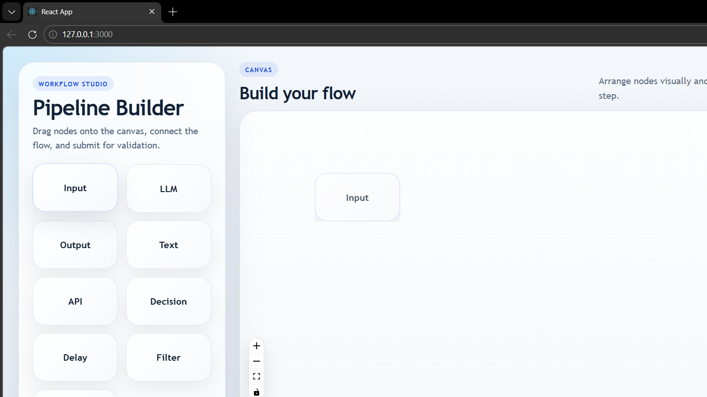

# VectorShift Frontend Technical Assessment

This repository contains a complete implementation of the VectorShift Frontend Technical Assessment. The project includes a React-based pipeline editor and a FastAPI backend that parses the submitted graph and validates whether it is a Directed Acyclic Graph (DAG).

## Frontend Screenshot



## What Is Included

### Node-based pipeline builder
- Drag-and-drop node creation from a styled toolbar
- Visual graph editing on a React Flow canvas
- Input and output handles for connecting nodes
- Submit action that sends the current pipeline to the backend

### Reusable node abstraction
- A shared `BaseNode` component standardizes node layout, title rendering, body content, handle rendering, and styling
- Existing nodes using the abstraction:
  - `InputNode`
  - `OutputNode`
  - `LLMNode`
  - `TextNode`
- Additional nodes created to demonstrate extensibility:
  - `APINode`
  - `DecisionNode`
  - `DelayNode`
  - `FilterNode`
  - `MergeNode`

### Text node enhancements
- Automatically resizes based on the entered content
- Detects variables in the format `{{variableName}}`
- Adds dynamic input handles for detected variables
- Accepts only valid JavaScript variable identifiers
- Updates handles live as the text changes

### Backend integration
- Frontend submits `nodes` and `edges` to `POST /pipelines/parse`
- Backend returns:
  - `num_nodes`
  - `num_edges`
  - `is_dag`
- Frontend displays the backend response in a user-friendly alert

## UI and Design Improvements

The frontend was refined to feel closer to a production workflow builder while preserving the original functionality:

- Cleaner overall layout with a dedicated sidebar and main canvas area
- More polished typography and spacing
- Consistent visual system across all nodes
- Improved button, toolbar, minimap, and canvas styling
- Better hover and focus states
- Responsive behavior for smaller screens

## Project Structure

```text
frontend/
  src/
    App.js
    toolbar.js
    ui.js
    submit.js
    draggableNode.js
    store.js
    nodes/
      BaseNode.js
      inputNode.js
      outputNode.js
      llmNode.js
      textNode.js
      apiNode.js
      decisionNode.js
      delayNode.js
      filterNode.js
      mergeNode.js
      nodeStyles.css
    index.css
    setupProxy.js

backend/
  main.py

docs/
  frontend-screenshot.png
```

## Architecture Overview

### Frontend

The frontend is built with React and React Flow.

- `App.js` defines the top-level layout
- `toolbar.js` renders the draggable node palette
- `ui.js` manages the React Flow canvas and node drop behavior
- `submit.js` sends the current graph to the backend
- `store.js` keeps node and edge state in a shared Zustand store

### Node abstraction

`frontend/src/nodes/BaseNode.js` is the reusable abstraction for node rendering. It supports:

- configurable title
- configurable input handles
- configurable output handles
- arbitrary content via `children`
- shared styling and layout

This keeps new node creation lightweight and avoids duplicating the same structure in every node file.

### Text node logic

`frontend/src/nodes/textNode.js` adds the custom Text node behavior:

- extracts variables with a regular expression
- deduplicates detected variables
- recalculates node dimensions as text grows
- updates node internals so handles re-render dynamically

### Backend

The backend is built with FastAPI in `backend/main.py`.

`/pipelines/parse`:
- receives the submitted nodes and edges
- counts both collections
- checks whether the graph is acyclic

The DAG check is implemented using indegree counting and topological traversal.

## How to Run

### 1. Start the backend

```bash
cd backend
python -m uvicorn main:app --host 127.0.0.1 --port 8000 --reload
```

### 2. Start the frontend

```bash
cd frontend
npm install
npm start
```

The frontend runs on `http://localhost:3000` and proxies `/pipelines/*` requests to the FastAPI backend.

## How to Test the Final Flow

1. Start both backend and frontend
2. Drag a few nodes from the left toolbar onto the canvas
3. Connect the nodes
4. Click `Submit`
5. Confirm that an alert appears showing:
   - number of nodes
   - number of edges
   - whether the graph is a DAG

## Notes

- The implementation keeps the required functionality intact while improving code organization and visual quality
- The frontend build passes successfully
- The backend compiles and the `/pipelines/parse` endpoint responds correctly
